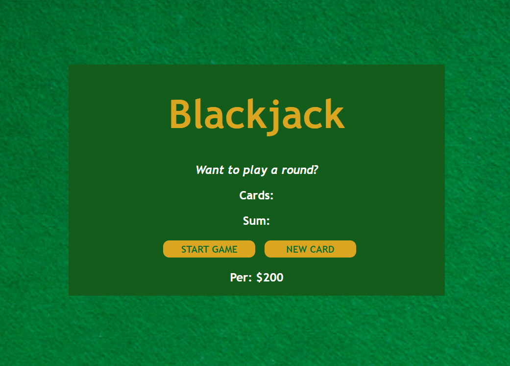
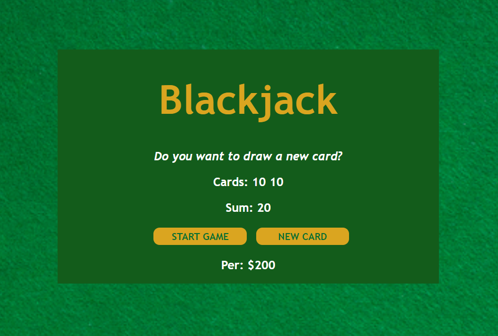
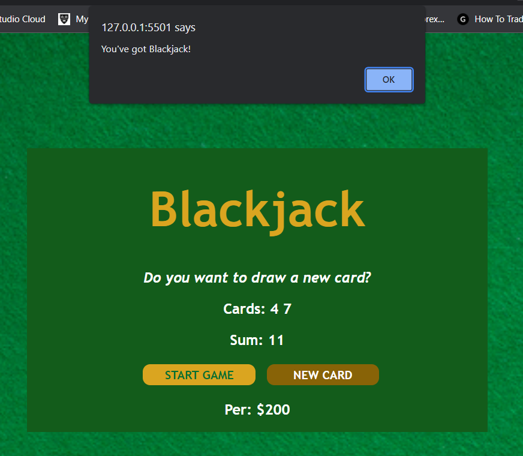
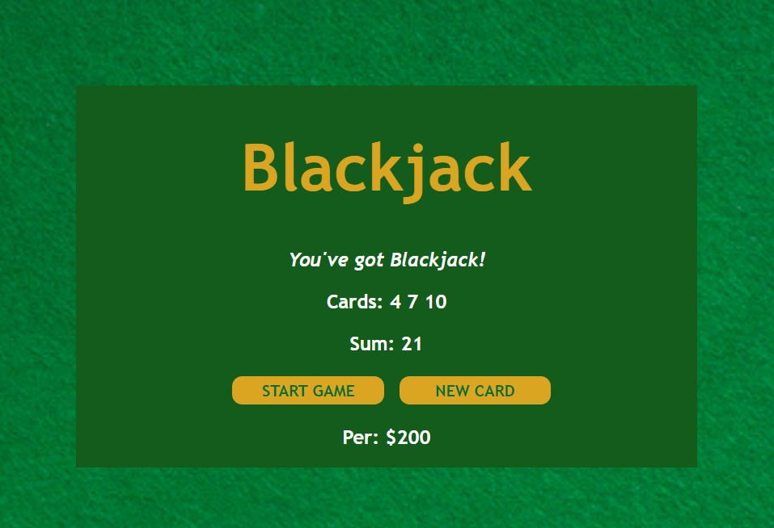
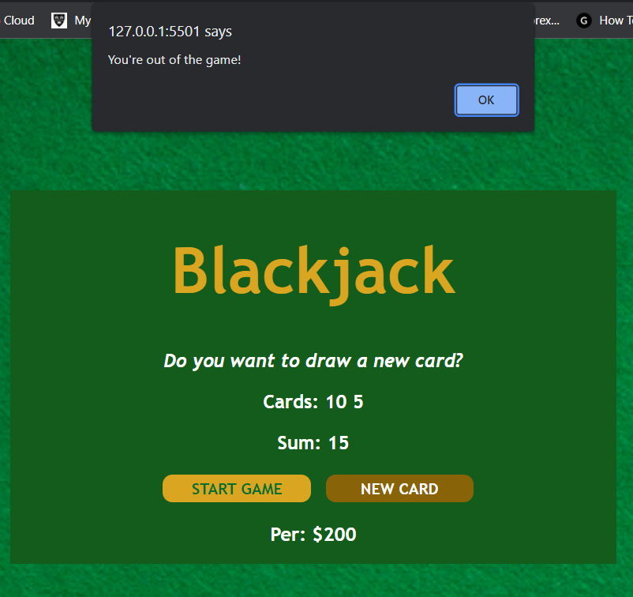
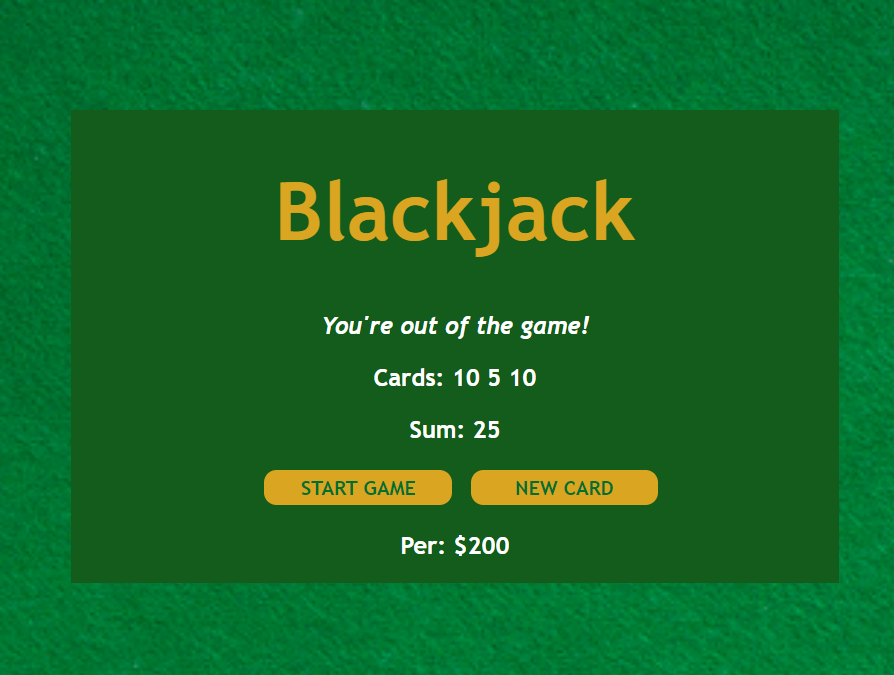

# Blackjack Game

## An Overviwe of the game

This is a simplified version of the blackjack card game created with HTML, CSS, and Javascript.
The game was designed with a simple layout in mind, and it draws cards at random from a deck of 13 cards. If the sum of the cards reaches 21, you have a blackjack; if it exceeds 21, you are out of the game.
You can keep drawing cards as long as the total number of cards drawn is less than 21. When the sum is exactly 21 or higher, the game ends, and the player either has a blackjack or is out of the game. At the bottom, the game displays the player's name and money.

### How To Play The Game

To begin the game, click the start game button, and two cards will be drawn at random from the deck. The number of each card will be shown in the "Cards:" section, and the sum will be shown in the "Sum:" section.
If the sum is less than 21, the following message will be displayed: "Do you want to draw a new card?"

To add a new card to your deck, click the new card button, and you can keep drawing cards as long as the total number of cards drawn is less than 21.
When the sum is exactly 21 or higher, the game is over, with an alert showing that the player either has a blackjack or is out of the game, as shown below.

### Blackjack

### Out of the game

